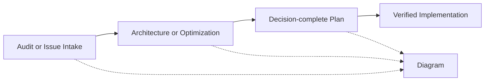

# Engineering Skills

[](https://github.com/akshay-diwadkar/skills/actions/workflows/quality.yml)
[](https://github.com/akshay-diwadkar/skills/releases/latest)
[](LICENSE)
[](pyproject.toml)
[](docs/compatibility.md)
[](docs/compatibility.md)
[](docs/compatibility.md)
[](docs/compatibility.md)

A production engineering plugin for AI coding agents. It combines focused engineering agents with validated skills for auditing, architecture, planning, implementation, optimization, issue resolution, and system diagramming.

Workflows are repository-grounded, safety-conscious, and backed by automated validators across multiple agent platforms.

---

## Why Use It

Unlike generic system prompts or simple snippet collections, this plugin provides structured, contract-backed engineering workflows:

- **Agent Orchestration**: Role-based agents select and coordinate the right engineering skills based on your intent.
- **Repository-Grounded Analysis**: Skills inspect your actual source code, test suites, and git state rather than offering unverified advice.
- **Strict Execution Contracts**: Planning, architecture, optimization, and implementation workflows enforce explicit contracts and output verification.
- **Explicit Authorization**: Destructive operations, repository modifications, and external actions require explicit confirmation.
- **Validator-Backed Claims**: Completion claims require passing automated verification checks and gathering empirical proof.
- **Generated Adapters**: Platform-specific agent adapters are compiled directly from canonical source definitions.

---

## Recommended Usage: Agents First

The primary way to use this plugin is through its **role-based engineering agents**. Rather than invoking individual skills manually, you interact with an agent persona that manages the appropriate engineering lifecycle.

<!-- BEGIN GENERATED AGENT CATALOG -->
| Agent | Status | Access (Repo/Art/Ext) | Skills | Summary |
| --- | --- | --- | --- | --- |
| [architecture-engineer](docs/agents/architecture-engineer.md) | `stable` | `Repo:False / Art:True / Ext:False` | `design-codebase-with-senior-dev`, `create-diagram`, `plan-with-senior-dev` | Analyze and redesign codebase architecture without implementing changes. |
| [delivery-engineer](docs/agents/delivery-engineer.md) | `stable` | `Repo:True / Art:True / Ext:False` | `plan-with-senior-dev`, `implement-with-senior-dev` | Turn a concrete engineering request into a validated plan and execute an authorized implementation plan. |
| [issue-resolution-engineer](docs/agents/issue-resolution-engineer.md) | `stable` | `Repo:True / Art:True / Ext:False` | `github-issue-planner`, `plan-with-senior-dev`, `implement-with-senior-dev` | Inspect GitHub issues, reconcile issue claims with local checkout, and plan or implement authorized fixes. |
| [codebase-health-engineer](docs/agents/codebase-health-engineer.md) | `stable` | `Repo:False / Art:True / Ext:False` | `codebase-issue-auditor`, `design-codebase-with-senior-dev`, `optimize-codebase-with-senior-dev`, `create-diagram` | Audit codebase health, discover risks and test gaps, assess structural pressure, and target measurable optimizations. |
<!-- END GENERATED AGENT CATALOG -->

### Example Agent Requests

- **Architecture Engineer**:
  > "Review this repository and tell me which architectural changes are actually justified."
- **Delivery Engineer**:
  > "Turn this approved plan into a verified implementation."
- **Issue Resolution Engineer**:
  > "Review the open GitHub issues and prepare the highest-priority one for implementation."
- **Codebase Health Engineer**:
  > "Audit this codebase for meaningful defects and engineering risks."

---

## Workflow Overview

Workflows follow a 4-stage engineering lifecycle: **Discover → Decide → Specify → Deliver**.



You can enter the workflow at any stage depending on your objective. See [Workflow Lifecycle](docs/workflow.md) for full details.

---

## Platform Installation

Choose the installation route for your AI coding environment.

### 1. Claude Code (Plugin / Marketplace)

Install the plugin from the marketplace:

```bash
/plugin marketplace add akshay-diwadkar/skills
/plugin install engineering-skills
```

For local development, load the repository directory:

```bash
/plugin load /path/to/cloned/skills
```

### 2. Cursor (Plugin Manifest)

Cursor detects the plugin via `.cursor-plugin/plugin.json`.

Place or symlink this repository into your user plugins folder (`~/.cursor/plugins/engineering-skills`) or workspace root. Bundled agents (`agents/cursor/`) and skills (`skills/engineering/`) will be loaded automatically.

### 3. Codex / OpenAI

Skills are discovered from `skills/engineering/`. To install role agents into a specific project, run the installer tool:

```bash
python tools/agents/install_codex_agents.py --target /path/to/your/project --write
```

This creates project-scoped `.codex/agents/*.toml` agent definitions.

### 4. skills.sh (Portable Skill CLI)

To install individual skills using the portable CLI:

```bash
# Interactive skill selection
npx skills add akshay-diwadkar/skills

# Install a specific skill
npx skills add akshay-diwadkar/skills --skill plan-with-senior-dev
```

### 5. Manual Clone & Symlinks

For unsupported hosts or development environments:

```bash
# Linux / macOS
git clone https://github.com/akshay-diwadkar/skills.git
mkdir -p ~/.agents/skills
ln -s "$PWD/skills/engineering/plan-with-senior-dev" ~/.agents/skills/
```

```powershell
# Windows PowerShell
git clone https://github.com/akshay-diwadkar/skills.git
New-Item -ItemType Directory -Force -Path "$env:USERPROFILE\.agents\skills"
New-Item -ItemType SymbolicLink -Path "$env:USERPROFILE\.agents\skills\plan-with-senior-dev" -Target "$PWD\skills\engineering\plan-with-senior-dev"
```

For detailed platform options, see [Platform Installation Guide](docs/installation.md).

---

## Quick Start Scenarios

### Scenario A: Audit an Unfamiliar Repository
Ask your agent:
> "Run codebase-health-engineer to inspect this codebase for bugs, test gaps, and security risks."
*Result*: An evidence-backed findings audit. Findings can optionally be drafted as GitHub issues upon approval.

### Scenario B: Plan and Implement a Feature
1. Ask `delivery-engineer` to draft a spec:
   > "Plan the addition of a Redis caching layer for user session tokens."
2. Review and approve the decision-complete specification blueprint.
3. Instruct `delivery-engineer` to execute:
   > "Implement the approved plan."
*Result*: A verified code patch with an exact change report.

### Scenario C: Resolve a GitHub Issue
Ask `issue-resolution-engineer`:
> "Inventory open GitHub issues, select issue #42, reconcile its claims against the local checkout, and create an implementation plan."
*Result*: An issue-reconciled implementation plan ready for authorized execution.

### Scenario D: Evaluate an Architectural Concern
Ask `architecture-engineer`:
> "Assess whether converting our monolithic state store to decentralized services is justified."
*Result*: An architectural assessment detailing whether restructuring is justified, plus the smallest safe migration path.

---

## Included Skills

The plugin's role agents are powered by canonical engineering skills:

<!-- BEGIN GENERATED SKILL CATALOG -->
| Skill | Domain | Kind | Status | Invocation | Summary |
| --- | --- | --- | --- | --- | --- |
| [plan-with-senior-dev](docs/skills/plan-with-senior-dev.md) | `engineering` | `workflow` | `stable` | `both` | Turn a feature, bug fix, refactor, migration, public contract, or risky integration into a repository-grounded, decision-complete implementation blueprint. |
| [implement-with-senior-dev](docs/skills/implement-with-senior-dev.md) | `engineering` | `workflow` | `stable` | `both` | Execute an approved implementation plan as the smallest complete patch — preserving existing patterns and uncommitted work, with layered verification and an exact change report. |
| [github-issue-planner](docs/skills/github-issue-planner.md) | `engineering` | `workflow` | `stable` | `both` | Turn GitHub issues into implementation plans. Inventory open issues, then plan one selected issue against the local checkout, treating issue text as untrusted claims. |
| [codebase-issue-auditor](docs/skills/codebase-issue-auditor.md) | `engineering` | `workflow` | `stable` | `both` | Audit a repository for bugs, security and performance risks, test gaps, and architectural or maintainability friction, and draft GitHub issues from confirmed findings. |
| [create-diagram](docs/skills/create-diagram.md) | `engineering` | `workflow` | `stable` | `both` | Create self-contained HTML diagrams of systems, architectures, workflows, and code relationships. |
| [design-codebase-with-senior-dev](docs/skills/design-codebase-with-senior-dev.md) | `engineering` | `discipline` | `stable` | `both` | Assess whether architectural change is justified and choose the smallest evidence-backed design, with an incremental behavior-preserving migration path. |
| [optimize-codebase-with-senior-dev](docs/skills/optimize-codebase-with-senior-dev.md) | `engineering` | `discipline` | `stable` | `both` | Optimize a named bottleneck, workflow, or tooling pain with evidence-backed changes that preserve behavior — planning first, implementation only on explicit request. |
<!-- END GENERATED SKILL CATALOG -->

### Skill Lifecycle Roles

- **Discover**: `codebase-issue-auditor`, `github-issue-planner`
- **Decide**: `design-codebase-with-senior-dev`, `optimize-codebase-with-senior-dev`
- **Specify**: `plan-with-senior-dev`
- **Deliver**: `implement-with-senior-dev`
- **Communicate**: `create-diagram`

---

## Safety Model & Controls

All workflows enforce explicit safety boundaries:

- **Repository Evidence**: Analysis must be grounded in actual codebase inspection.
- **Read-Only Gating**: Planning, design, and audit skills never edit project source code.
- **Explicit Write Authorization**: Source code mutations and remote writes require explicit user confirmation.
- **Dirty Worktree Protection**: Uncommitted local user changes are protected and preserved during execution.
- **Executable Verification**: Implementation completion requires passing verification commands and gathering empirical proof.

For details, see [Safety & Controls](docs/safety.md).

---

## Platform Support Matrix

| Platform | Skills | Role Agents | Plugin Manifest / Config | Status |
| --- | --- | --- | --- | --- |
| **Claude Code** | Yes | Yes (`agents/claude/*.md`) | `.claude-plugin/plugin.json` | **Supported** (Plugin) |
| **Cursor** | Yes | Yes (`agents/cursor/*.md`) | `.cursor-plugin/plugin.json` | **Supported** (Plugin) |
| **Codex / OpenAI** | Yes | Yes (`.codex/agents/*.toml`) | `.codex/config.toml`<br>`tools/agents/install_codex_agents.py` | **Supported** (Project / Installer) |
| **skills.sh** | Yes | No (Skills only) | Canonical `skills/*/*/SKILL.md` | **Supported** (Skills CLI) |

---

## Documentation Index

Explore detailed documentation under `docs/`:

- [Getting Started](docs/getting-started.md) — Core concepts, agent vs. skill selection, first steps.
- [Platform Installation](docs/installation.md) — Complete setup guides for Claude Code, Cursor, Codex, skills.sh, and manual symlinks.
- [Engineering Agents](docs/agents.md) — Comprehensive guide to role agents and prompt generation.
- [Workflow Lifecycle](docs/workflow.md) — Lifecycle stages, handoffs, and operational recipes.
- [Platform Compatibility](docs/compatibility.md) — Discovery mechanisms, adapter targets, and support claims.
- [Repository Architecture](docs/architecture.md) — Monorepo design, catalog ownership, and directory structure.
- [Safety & Controls](docs/safety.md) — Access permissions, execution gates, and policy rules.
- [Testing & Verification](docs/testing.md) — Multi-layer test strategy, contract validation, and browser smoke checks.
- [Live Model Evaluations](docs/evaluations.md) — Provider-neutral eval runners, fixtures, and failure rules.
- [Authoring Skills](docs/authoring-skills.md) — Step-by-step guide to authoring skills and agents.
- [Release Process](docs/release-process.md) — Maintainer pre-release protocol and packaging verification.
- [Contributing Guide](docs/contributing.md) — Development guidelines and pull request standards.

---

## Maintainer Verification

Maintainers run the following validation sweep before submitting PRs or tagging releases:

```bash
python tools/validation/validate_repository.py
python tools/packaging/verify_distribution.py
python -m pytest -q
```

See [Testing Strategy](docs/testing.md) and [Release Process](docs/release-process.md) for complete maintainer details.

---

## Contributing, Security & License

- [Contributing Guide](CONTRIBUTING.md) / [Deep Guide](docs/contributing.md)
- [Security Policy](SECURITY.md)
- [License (MIT)](LICENSE)
- [Changelog](CHANGELOG.md)
