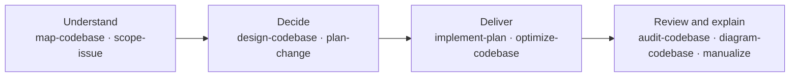

# Engineering and Technical Communication Skills

[](https://github.com/akshay-diwadkar/skills/actions/workflows/quality.yml?query=branch%3Amain)
[](https://github.com/akshay-diwadkar/skills/releases/latest)
[](LICENSE)
[](pyproject.toml)

Repository-grounded skills for planning, implementing, reviewing, optimizing, visualizing, and documenting software changes with AI coding agents.

Each skill is a self-contained package with focused instructions and, where needed, scripts, schemas, templates, and validators. Install the complete collection or choose only the workflow you need.

## Why use these skills?

- **Ground decisions in the repository.** Workflows inspect current source, configuration, tests, and contracts before proposing changes.
- **Turn requests into verifiable artifacts.** Planning and execution skills produce structured outputs that can be checked before work moves forward.
- **Keep responsibilities clear.** Separate skills handle discovery, design, planning, implementation, review, visualization, and documentation.
- **Use skills independently or together.** Start with one focused task or compose several skills into an end-to-end engineering workflow.

## Choose the right skill

### Engineering workflows

| Skill | Use it when you need to… |
| --- | --- |
| [`plan-change`](skills/engineering/plan-change/SKILL.md) | Turn a feature, bug fix, refactor, migration, or integration request into a decision-complete implementation plan. |
| [`implement-plan`](skills/engineering/implement-plan/SKILL.md) | Execute an approved plan as a minimal patch while preserving repository patterns and uncommitted work. |
| [`scope-issue`](skills/engineering/scope-issue/SKILL.md) | Triage GitHub issues and plan one selected issue against the local checkout. |
| [`audit-codebase`](skills/engineering/audit-codebase/SKILL.md) | Find confirmed bugs, security or performance risks, test gaps, and maintainability problems. |
| [`diagram-codebase`](skills/engineering/diagram-codebase/SKILL.md) | Create a self-contained HTML diagram of a system, architecture, workflow, or code relationship. |

### Engineering disciplines and utilities

| Skill | Use it when you need to… |
| --- | --- |
| [`design-codebase`](skills/engineering/design-codebase/SKILL.md) | Decide code boundaries, dependency direction, state ownership, or another structural design before planning implementation. |
| [`optimize-codebase`](skills/engineering/optimize-codebase/SKILL.md) | Investigate and improve a named performance, build, CI, dependency, maintainability, or developer-experience bottleneck. |
| [`map-codebase`](skills/engineering/map-codebase/SKILL.md) | Understand an unfamiliar repository and locate the files or symbols that own a requested change. |

### Technical communication

| Skill | Use it when you need to… |
| --- | --- |
| [`manualize`](skills/technical-communication/manualize/SKILL.md) | Write or audit source-grounded manuals, procedures, runbooks, guides, notices, error messages, or reference documentation. |

## How the skills fit together

Use only the stages your task requires:


```mermaid
flowchart LR
    A["Understand<br/>map-codebase · scope-issue"]
    B["Decide<br/>design-codebase · plan-change"]
    C["Deliver<br/>implement-plan · optimize-codebase"]
    D["Review and explain<br/>audit-codebase · diagram-codebase · manualize"]

    A --> B --> C --> D
```

## Install and use

The [`skills` CLI](https://www.skills.sh/docs/cli) can discover and install the packages for supported AI coding agents.

The installer groups the collection into **Engineering Skills** and
**Technical Communication Skills**, so you can quickly select the part of the
suite you need.

### 1. Inspect the available skills

```bash
npx skills add akshay-diwadkar/skills --list
```

### 2. Install the collection or one skill

Install all skills and choose the target agent when prompted:

```bash
npx skills add akshay-diwadkar/skills --skill '*'
```

Or install a single skill:

```bash
npx skills add akshay-diwadkar/skills --skill plan-change
```

Add `--global` to make an installation available across projects, or use `--agent <agent-name>` to select a supported agent explicitly.

### 3. Ask for the workflow you need

After installation, describe the task in your agent's chat. For example:

```text
Map this repository and show me where authentication is implemented.
```

```text
Plan a migration from the current database client to connection pooling.
```

```text
Implement the approved plan in docs/plans/connection-pooling.md.
```

```text
Audit this repository for security risks and missing tests.
```

```text
Write an installation runbook from the checked-in configuration and scripts.
```

The selected agent decides when to invoke an installed skill based on its name and description. You can mention the skill explicitly when you want a particular workflow.

## Requirements and compatibility

- **Skill installation:** Node.js with `npx`, plus an agent supported by the `skills` CLI.
- **Bundled runtime scripts:** Python 3.11 or newer.
- **Skill-specific packages:** Install the `requirements.txt` inside a skill directory when that skill includes one.
- **Repository verification:** CI exercises the suite on Linux, macOS, and Windows with Python 3.11 and 3.12.

Individual skills may require extra tools or credentials for their target workflow. Read the selected skill's `SKILL.md` before running its scripts.

## Development and verification

Clone the repository, create a Python environment, and install the dependencies required by the skills you are changing. The repository's quality checks are:

```bash
# Lint Python
ruff check .

# Run static type checks
python tools/validation/run_mypy.py

# Validate skill structure and metadata
python tools/validation/validate_repository.py

# Run the test suite
python -m pytest -q
```

Benchmark fixtures, methodology, limitations, baselines, and the cross-skill migration matrix are documented in [`benchmarks/`](benchmarks/README.md).

## License

Released under the [MIT License](LICENSE).
