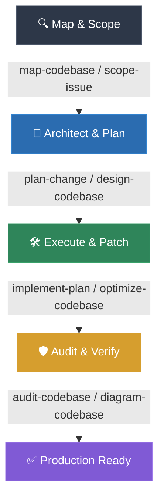

# Engineering Skills

[](https://github.com/akshay-diwadkar/skills/actions/workflows/quality.yml?query=branch%3Amain)
[](LICENSE)
[](pyproject.toml)
[](#-skill-catalog)

> **Production-grade, evidence-backed engineering skills built for autonomous AI coding agents and human software engineers.**

---

## 💡 Overview

This repository provides a standardized, self-contained suite of **Engineering Skills** designed to augment AI coding assistants (such as **Google Antigravity**, **Cursor**, **Claude Code**, and **Windsurf**) as well as human developers. 

Each skill delivers repository-grounded workflows, opinionated guidelines, bundled scripts, and test suites that ensure high precision, minimal hallucination, and deterministic engineering outcomes.

---

## 🔄 Interlocking Workflow Architecture

Engineering tasks flow seamlessly across specialized skills. Use them individually or chain them together for end-to-end software delivery:


```mermaid
flowchart TD
    A[🔍 Map & Scope] -->|map-codebase / scope-issue| B[📐 Architect & Plan]
    B -->|plan-change / design-codebase| C[🛠️ Execute & Patch]
    C -->|implement-plan / optimize-codebase| D[🛡️ Audit & Verify]
    D -->|audit-codebase / diagram-codebase| E[✅ Production Ready]

    style A fill:#2d3748,stroke:#4a5568,color:#fff
    style B fill:#2b6cb0,stroke:#3182ce,color:#fff
    style C fill:#2f855a,stroke:#38a169,color:#fff
    style D fill:#d69e2e,stroke:#d69e2e,color:#fff
    style E fill:#805ad5,stroke:#9f7aea,color:#fff
```

---

## 🎯 Skill Catalog

The repository features 8 canonical engineering skills organized into **Workflows**, **Disciplines**, and **Utilities**:

### 🛠️ Workflows
| Skill | Invocation | Description |
| :--- | :---: | :--- |
| **[plan-change](skills/engineering/plan-change/SKILL.md)** | `both` | Transform features, bug fixes, refactors, or migrations into decision-complete, repository-grounded blueprints. |
| **[implement-plan](skills/engineering/implement-plan/SKILL.md)** | `both` | Execute approved blueprints as minimal, behavior-preserving patches with strict layered verification. |
| **[scope-issue](skills/engineering/scope-issue/SKILL.md)** | `both` | Inventory GitHub issues and resolve them into executable implementation plans against the checkout. |
| **[audit-codebase](skills/engineering/audit-codebase/SKILL.md)** | `both` | Audit codebases for security risks, performance bottlenecks, and architectural friction, generating actionable issues. |
| **[diagram-codebase](skills/engineering/diagram-codebase/SKILL.md)** | `both` | Generate self-contained HTML visual diagrams of system architecture, workflows, and module relationships. |

### 📐 Disciplines
| Skill | Invocation | Description |
| :--- | :---: | :--- |
| **[design-codebase](skills/engineering/design-codebase/SKILL.md)** | `both` | Evaluate architectural changes and specify minimal, evidence-backed designs with safe migration paths. |
| **[optimize-codebase](skills/engineering/optimize-codebase/SKILL.md)** | `both` | Measure, benchmark, and resolve named performance bottlenecks without introducing behavior regressions. |

### 🔍 Utilities
| Skill | Invocation | Description |
| :--- | :---: | :--- |
| **[map-codebase](skills/engineering/map-codebase/SKILL.md)** | `both` | Generate compact repository navigation maps and bound code exploration into evidence-backed read phases. |

---

## 🚀 How to Use

### 🤖 1. Adding Skills to AI Agents (Antigravity, Cursor, Claude Code, etc.)

Install skills into your project repo or agent environment using `npx`:

```bash
# Add all engineering skills to your active workspace/agent
npx skills add akshay-diwadkar/skills

# Add only a specific skill (e.g. plan-change)
npx skills add akshay-diwadkar/skills --skill plan-change
```

Once installed, your AI agent automatically reads each skill's `SKILL.md` and uses its guidelines, workflows, and bundled scripts whenever you request matching engineering tasks.

### 💬 2. Triggering Skills via Chat Prompts

Once installed, simply request tasks in your AI assistant's chat interface (such as Antigravity, Cursor, or Claude Code). The agent detects installed skills and executes their workflow:

```markdown
# Example: Triggering the plan-change skill
"Plan a refactor to migrate our database client to connection pooling."

# Example: Triggering the audit-codebase skill
"Audit our repository for security risks and performance bottlenecks."

# Example: Triggering the scope-issue skill
"Scope open issue #42 and build an implementation blueprint."
```


---

## 🧪 Quality & Verification

We enforce strict repository health and verification standards across all skills using automated linters, static typing, unit testing, and custom skill validators:

```bash
# Run Ruff linting
ruff check .

# Run Mypy static type checking
python tools/validation/run_mypy.py

# Validate repository skill structure & metadata
python tools/validation/validate_repository.py

# Execute full pytest suite
python -m pytest -q
```

---

## 📄 License

This repository is distributed under the [MIT License](LICENSE).

