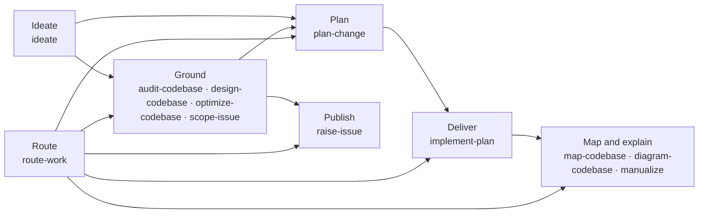

# Engineering, Research, and Technical Communication Skills

[](https://github.com/akshay-diwadkar/skills/actions/workflows/quality.yml?query=branch%3Amain)
[](https://github.com/akshay-diwadkar/skills/releases/latest)
[](LICENSE)
[](pyproject.toml)

Repository-grounded skills for planning, implementing, reviewing, optimizing, visualizing, researching ideas, and documenting software changes with AI coding agents.

Each skill is a self-contained package with focused instructions and, where needed, scripts, schemas, templates, and validators. Install the complete collection or choose only the workflow you need.

## Why use these skills?

- **Ground decisions in the repository.** Workflows inspect current source, configuration, tests, and contracts before proposing changes.
- **Turn requests into verifiable artifacts.** Planning and execution skills produce structured outputs that can be checked before work moves forward.
- **Keep responsibilities clear.** Separate skills handle discovery, design, planning, implementation, review, visualization, and documentation.
- **Use skills independently or together.** Start with one focused task or compose several skills into an end-to-end engineering workflow.

## Choose the right skill

### Request routing

| Skill | Use it when you need to… |
| --- | --- |
| [`route-work`](skills/routing/route-work/SKILL.md) | Validate the agent-chosen workflow across engineering, research, and technical communication skills and return one decision with an inline `route_handoff` (compact by default; detailed guidance and file persistence are opt-in). |

### Engineering workflows

| Skill | Use it when you need to… |
| --- | --- |
| [`plan-change`](skills/engineering/plan-change/SKILL.md) | Explore natively, draft an implementation plan (`docs/plans/*.md`), and seal cited repository proof in one pass. |
| [`implement-plan`](skills/engineering/implement-plan/SKILL.md) | Execute an approved implementation plan (`docs/plans/*.md`) as a minimal patch while preserving repository patterns and uncommitted work. |
| [`scope-issue`](skills/engineering/scope-issue/SKILL.md) | Ground one GitHub issue and seal `issue-handoff.md` for planning. |
| [`audit-codebase`](skills/engineering/audit-codebase/SKILL.md) | Find confirmed bugs, security or performance risks, test gaps, and maintainability problems and seal `audit-handoff.md`. |
| [`raise-issue`](skills/engineering/raise-issue/SKILL.md) | Preview and publish sealed `audit-handoff.md` artifacts as GitHub issues. |
| [`diagram-codebase`](skills/engineering/diagram-codebase/SKILL.md) | Create a self-contained HTML diagram artifact of a system, architecture, workflow, or code relationship. |

### Engineering disciplines and utilities

| Skill | Use it when you need to… |
| --- | --- |
| [`design-codebase`](skills/engineering/design-codebase/SKILL.md) | Decide structural boundaries and seal `design-handoff.md` for planning. |
| [`optimize-codebase`](skills/engineering/optimize-codebase/SKILL.md) | Select an evidence-backed optimization and seal `optimization-handoff.md` for planning. |
| [`map-codebase`](skills/engineering/map-codebase/SKILL.md) | Understand an unfamiliar repository and locate the files or symbols that own a requested change. |

### Technical communication

| Skill | Use it when you need to… |
| --- | --- |
| [`manualize`](skills/technical-communication/manualize/SKILL.md) | Write or audit source-grounded manuals, procedures, runbooks, guides, notices, error messages, or reference documentation. |

### Research

| Skill | Use it when you need to… |
| --- | --- |
| [`ideate`](skills/research/ideate/SKILL.md) | Generate and rank evidence-linked candidate ideas and seal `ideas.md` for any researchable goal (software, business, product, academic, hobby, lifestyle, and other domains). |

## How the skills fit together

Use only the stages your task requires:


```mermaid
flowchart LR
    R["Route<br/>route-work"]
    A["Ground<br/>audit-codebase · design-codebase · optimize-codebase · scope-issue"]
    B["Plan<br/>plan-change"]
    C["Deliver<br/>implement-plan"]
    D["Map and explain<br/>map-codebase · diagram-codebase · manualize"]
    P["Publish<br/>raise-issue"]
    I["Ideate<br/>ideate"]

    R --> A
    R --> B
    R --> C
    R --> D
    R --> P
    A --> B --> C --> D
    A --> P
    I --> A
    I --> B
```

## Install and use

The [`skills` CLI](https://www.skills.sh/docs/cli) can discover and install the packages for AI coding agents. Invocation policy is certified for Claude Code, Codex, and GitHub Copilot; installation to other CLI targets remains portable on a best-effort basis without a repository guarantee that the host enforces invocation metadata.

The installer groups the collection into **Routing Skills**, **Engineering Skills**, **Research Skills**, and
**Technical Communication Skills**, so you can quickly select the part of the
suite you need.

### 1. Inspect the available skills

```bash
npx skills add akshay-diwadkar/skills --list
```

### 2. Install the collection or one skill

Install all skills and choose a certified target agent when prompted:

```bash
npx skills add akshay-diwadkar/skills --skill '*'
```

Or install a single skill:

```bash
npx skills add akshay-diwadkar/skills --skill plan-change
```

Add `--global` to make an installation available across projects, or use `--agent <agent-name>` to select a supported agent explicitly.

Certified agent names are `claude-code`, `codex`, and `github-copilot`. For example:

```bash
npx skills add akshay-diwadkar/skills --skill '*' --agent codex
```

### 3. Ask for the workflow you need

After installation, describe the task in your agent's chat. For example:

```text
Map this repository and show me where authentication is implemented.
```

```text
Plan a migration from the current database client to connection pooling.
```

```text
Implement the approved plan in docs/plans/connection-pooling.md.
```

```text
Audit this repository for security risks and missing tests.
```

```text
Write an installation runbook from the checked-in configuration and scripts.
```

```text
Ideate ways to reduce our API response latency below 200ms.
```

### Invocation behavior

Every skill declares one provider-neutral invocation mode. Claude Code and GitHub Copilot enforce the mode through `SKILL.md` frontmatter; Codex enforces implicit activation through `agents/openai.yaml`.

| Mode | Skills | Behavior |
| --- | --- | --- |
| `model-invoked` | `route-work`, `map-codebase` | Available for lightweight read-only assistance without a direct user invocation. Hidden from the Claude Code and GitHub Copilot user menus. |
| `both` | `plan-change`, `design-codebase`, `manualize`, `ideate` | May be selected by the model or invoked directly. Existing workflow gates still require explicit authority before writes or remediation. |
| `user-invoked` | `implement-plan`, `audit-codebase`, `optimize-codebase`, `scope-issue`, `diagram-codebase`, `raise-issue` | Never activated implicitly on certified platforms. Invoke it directly when you want the workflow. |

Invoke a skill with `/skill-name` in Claude Code or GitHub Copilot. In Codex, type `$skill-name` or use `/skills`. Codex supports disabling implicit invocation but does not expose a model-only user-visibility control, so its `model-invoked` skills can still be selected explicitly.

Invocation metadata controls activation, not authority. Destructive operations, repository implementation, publication, external writes, and document remediation retain their workflow-specific confirmation and authorization gates.

### Common executable protocol

Every executable skill has a skill-local `scripts/cli.py`. Stateful workflows
use the same provider-neutral command shape:

```bash
python /absolute/skill/scripts/cli.py \
  --repo-root /absolute/repository \
  --run-dir /absolute/external/run \
  --input name=value \
  --format json \
  doctor
```

Continue with the returned `next_command`; each `next` response discloses only
the references, inputs, and write permissions for its new phase. Depending on
the skill, the lifecycle uses `start`, `status`, `next`, `validate`, and
`finalize`.

The read-only router is stateless:

```bash
python skills/routing/route-work/scripts/cli.py \
  --repo-root /absolute/repository \
  --input selected_skills=audit-codebase \
  --input selected_skills=raise-issue \
  --format json \
  run
```

`map-codebase` retains its established command-first compatibility syntax:

```bash
python skills/engineering/map-codebase/scripts/cli.py status \
  --repo-root /absolute/repository --format json
```

Its common progressive lifecycle uses global options first and returns
ownership, constraints, and impacts on successive calls. External writes such
as audit issue publication and post-merge issue comments require their
existing preflight plus explicit protocol authorization; no read-only branch
acquires write permission implicitly.

## Requirements and compatibility

- **Certified skill installation:** Node.js with `npx`, plus Claude Code, Codex, or GitHub Copilot.
- **Other Skills CLI agents:** Package installation may work, but invocation-policy enforcement is not certified by this repository.
- **Bundled runtime scripts:** Python 3.11 or newer.
- **Skill-specific packages:** Install the `requirements.txt` inside a skill directory when that skill includes one.
- **Repository verification:** CI exercises the suite on Linux, macOS, and Windows with Python 3.11 and 3.12.

Individual skills may require extra tools or credentials for their target workflow. Read the selected skill's `SKILL.md` before running its scripts.

## Development and verification

Clone the repository, create a Python environment, and install the dependencies required by the skills you are changing. The repository's quality checks are:

```bash
# Lint Python
ruff check .

# Run static type checks
python tools/validation/run_mypy.py

# Validate skill structure and metadata
python tools/validation/validate_repository.py

# Regenerate or verify committed context-load evidence
python tools/validation/measure_context_load.py --write
python tools/validation/measure_context_load.py --check

# Run the test suite
python -m pytest -q
```

Benchmark fixtures, methodology, limitations, baselines, and the cross-skill migration matrix are documented in [`benchmarks/`](benchmarks/README.md).
That directory also documents the blocking context-load budgets, generated
per-skill totals, pull-request deltas, and exception policy.

For the map-codebase resolver's current reproducible accuracy, safety, latency,
comparator, and task-coverage evidence, read the [benchmark report](benchmarks/map-codebase-benchmark.md).

## Publishing a release

When preparing a release, update `VERSION`, summarize the release in `VERSION_DESC.md`,
and update the release badge cache key at the top of this README to match `VERSION`.
After that change is merged to `main`, the Publish Release workflow creates the matching
`v<version>` tag and GitHub release. The workflow can also be run manually from `main`
to retry an interrupted publication. Release publication is restricted to the repository
owner; pull requests and other repository collaborators cannot invoke the publishing job.

## License

Released under the [MIT License](LICENSE).
