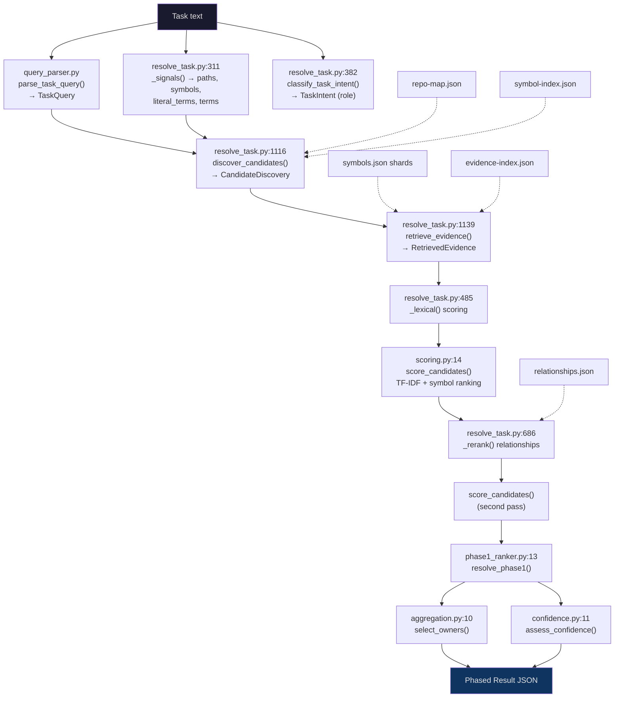

# Map-Codebase Resolver: Architecture & Gap Analysis

> Source-verified against all 11 resolver modules, `resolve_task.py` (1605 LOC),
> `resolver-design.md`, `methodology.md`, `fixture-audit.md`, and
> `benchmarks/reports/after-full.json`.

## 1. Executive Summary

The resolver is a deterministic, offline code-retrieval engine that converts a
natural-language task into a bounded set of file targets — enabling a low-to-medium
effort model to match the output quality of a high-effort model by focusing only on
the right context under fewer tokens. It currently achieves **Hit@1 = 0.944**,
**MRR = 0.972**, and a **222× token reduction** vs inventory baseline (2,797 vs
622,598 tokens).

Two release gates remain failing:

| Gate | Status | Root Cause |
|------|--------|-----------|
| `resolver_p95_under_2_seconds` | **FAIL** | Inline TF-IDF tokenization rebuilds per query |
| `legacy_smoke_no_regression` (realistic-large) | **FAIL** | Hard `continue` drops on legacy/generated components; 16/30 correct vs 30/30 baseline |

Three additional comparative checks also fail (`latency_budgets`, `legacy_smoke_no_regression`, `patch_noninferiority`) although `all_gates_pass` at the v2 level reads true — the failures are in the legacy smoke / comparative section.

## 2. Architecture



### Pipeline stages

| # | Stage | Entry Point | Input | Output |
|---|-------|-------------|-------|--------|
| 1 | **Query Parsing** | `query_parser.py:170` `parse_task_query()` | Task text | `TaskQuery` (positive/excluded concepts, component, subsystem, layer, intents, cardinality) |
| 2 | **Signal Extraction** | `resolve_task.py:311` `_signals()` | Task text | Paths, symbols, literal_terms, expanded terms |
| 3 | **Intent Classification** | `resolve_task.py:382` `classify_task_intent()` | Task + signals + files | `TaskIntent` (primary_role, secondary_roles) |
| 4 | **Candidate Discovery** | `resolve_task.py:1116` `discover_candidates()` | Files, symbol_index, signals, query | `CandidateDiscovery` (bounded path set, score-free) |
| 5 | **Evidence Retrieval** | `resolve_task.py:1139` `retrieve_evidence()` | Candidate paths | `RetrievedEvidence` (symbols, source_terms, descriptions) |
| 6 | **Lexical Scoring** | `resolve_task.py:485` `_lexical()` | Files, signals, weights | Scored candidates with evidence labels |
| 7 | **Structured Scoring** | `scoring.py:14` `score_candidates()` | Lexical output + symbols + query | Re-scored with TF-IDF, symbol ranking, component/subsystem/layer bonuses, penalties |
| 8 | **Relationship Reranking** | `resolve_task.py:686` `_rerank()` | Shortlist + relationships | Import, test, and entry-point evidence added |
| 9 | **Owner Selection** | `aggregation.py:10` `select_owners()` | Ranked list + targets + query | `OwnerSelection` (primary, co_owners, alternatives) |
| 10 | **Confidence** | `confidence.py:11` `assess_confidence()` | Ranked list + freshness + focus | `ConfidenceAssessment` (resolved/ambiguous/abstain, probability, level) |

## 3. Gap Inventory

| ID | Category | Severity | Description | Source Location | Suggested Fix |
|:---|:---------|:---------|:------------|:----------------|:-------------|
| **GAP-01** | Performance / Gate | **Critical** | P95 latency gate fails. `score_candidates()` rebuilds a full TF-IDF `file_document()` for every file on every query — O(files × symbols × tokens). | [`scoring.py:21-25`](file:///C:/Users/Akshay%20Diwadkar/OneDrive/Documents/New%20project/skills/skills/engineering/map-codebase/scripts/resolver/scoring.py#L21-L25) | Pre-compute document token sets and term frequencies in the build phase; store in knowledge artifacts. |
| **GAP-02** | Accuracy / Gate | **Critical** | `realistic-large` Hit@1 = 0.533 vs 1.0 baseline. Hard `continue` on lines 122 and 131-132 unconditionally drops files with `legacy`, `generated`, `migration`, or `documentation` component types — even when they're the canonical owners. | [`scoring.py:122-132`](file:///C:/Users/Akshay%20Diwadkar/OneDrive/Documents/New%20project/skills/skills/engineering/map-codebase/scripts/resolver/scoring.py#L122-L132) | Convert hard drops to heavy penalties (e.g., -80) instead of `continue`. Re-admit if no better candidate exists or if symbol evidence is strong. |
| **GAP-03** | Accuracy | **High** | Rigid -48 penalty when `requested_component_type` doesn't match, even with strong symbol/lexical evidence, causes false negatives in repos without component-typed filenames. | [`scoring.py:136-137`](file:///C:/Users/Akshay%20Diwadkar/OneDrive/Documents/New%20project/skills/skills/engineering/map-codebase/scripts/resolver/scoring.py#L136-L137) | Gate the -48 penalty behind a minimum symbol score threshold: skip if `best_symbol > 40`. |
| **GAP-04** | Accuracy | **High** | Workflow prior (+60) is an unjustified magic number that can dominate the entire score for orchestrator files, even when they're irrelevant. | [`scoring.py:146-155`](file:///C:/Users/Akshay%20Diwadkar/OneDrive/Documents/New%20project/skills/skills/engineering/map-codebase/scripts/resolver/scoring.py#L146-L155) | Cap at +30 or make proportional to other evidence (e.g., `min(60, best_symbol * 2)`). |
| **GAP-05** | Performance | **Medium** | Double `score_candidates()` invocation — once after `_lexical()` (line 1288), once after `_rerank()` (line 1312) — rebuilds TF-IDF matrices twice. | [`resolve_task.py:1288,1312`](file:///C:/Users/Akshay%20Diwadkar/OneDrive/Documents/New%20project/skills/skills/engineering/map-codebase/scripts/resolve_task.py#L1288) | Merge into a single pass by feeding relationship evidence into the first scoring call. |
| **GAP-06** | Design Drift | **Medium** | Design spec §3 says "bounded deterministic union before source is read" but `score_candidates()` eagerly loads all `symbols_by_path` for every candidate (line 22), violating the boundary. | [`scoring.py:22`](file:///C:/Users/Akshay%20Diwadkar/OneDrive/Documents/New%20project/skills/skills/engineering/map-codebase/scripts/resolver/scoring.py#L22), [`resolver-design.md:27`](file:///C:/Users/Akshay%20Diwadkar/OneDrive/Documents/New%20project/skills/skills/engineering/map-codebase/references/resolver-design.md#L27) | Defer symbol payload loading to after the lexical shortlist (top-24) is established. |
| **GAP-07** | Accuracy | **Medium** | `relationships.json` under-utilized for transitive relevance. `_rerank()` only looks at direct imports/tests (1 each), never walks the graph. Multi-layer ownership queries miss intermediary files. | [`resolve_task.py:686-719`](file:///C:/Users/Akshay%20Diwadkar/OneDrive/Documents/New%20project/skills/skills/engineering/map-codebase/scripts/resolve_task.py#L686-L719) | Allow 2-hop import traversal for candidates within the same subsystem. |
| **GAP-08** | Coverage | **Medium** | `subsystem_tokens()` uses `Path.parts` which produces different results on Windows (`\\` separators) vs POSIX. No explicit normalization. | [`features.py:47`](file:///C:/Users/Akshay%20Diwadkar/OneDrive/Documents/New%20project/skills/skills/engineering/map-codebase/scripts/resolver/features.py#L47) | Use `PurePosixPath` or normalize with `.replace("\\", "/")` before splitting. |
| **GAP-09** | Accuracy | **Medium** | Duplicate `path_segments` computation at lines 66 and 141 in `scoring.py` — wasteful and inconsistent with `subsystem_tokens()` which uses `Path.parts`. | [`scoring.py:66,141`](file:///C:/Users/Akshay%20Diwadkar/OneDrive/Documents/New%20project/skills/skills/engineering/map-codebase/scripts/resolver/scoring.py#L66) | Compute once, extract into a helper, use the same normalization as `subsystem_tokens()`. |
| **GAP-10** | Accuracy | **Low** | `layer_components` dict duplicated between `scoring.py:59-65` and `features.py:75-81` — a maintenance risk if they drift apart. | [`scoring.py:59`](file:///C:/Users/Akshay%20Diwadkar/OneDrive/Documents/New%20project/skills/skills/engineering/map-codebase/scripts/resolver/scoring.py#L59), [`features.py:75`](file:///C:/Users/Akshay%20Diwadkar/OneDrive/Documents/New%20project/skills/skills/engineering/map-codebase/scripts/resolver/features.py#L75) | Extract to a shared constant in `schemas.py`. |
| **GAP-11** | Coverage | **Low** | `_scoped_source_terms()` caps at 240 lines per file and 24 needles. Large files with important symbols beyond line 240 will have no source-term evidence. | [`resolve_task.py:1160-1206`](file:///C:/Users/Akshay%20Diwadkar/OneDrive/Documents/New%20project/skills/skills/engineering/map-codebase/scripts/resolve_task.py#L1160-L1206) | Increase cap or make it proportional to file size (e.g., min(500, file_lines)). |

## 4. Detailed Analysis

### A. Query Parsing — Solid, Well-Structured

[`query_parser.py`](file:///C:/Users/Akshay%20Diwadkar/OneDrive/Documents/New%20project/skills/skills/engineering/map-codebase/scripts/resolver/query_parser.py) handles contrastive negation, component aliasing (47 aliases), concept group expansion, subsystem extraction adjacent to component phrases, and owner cardinality detection. The `CONCEPT_GROUPS` (line 60-67) and `COMPONENT_ALIASES` (line 9-46) are comprehensive. No major gaps found here.

**Minor observation:** `_component()` (line 104) uses `explicit[-1]` rather than the most-specific match. If a query mentions both "service" and "orchestrator", the last one wins regardless of specificity. This is acceptable for single-component queries but could surprise on multi-component descriptions.

### B. Candidate Discovery — Design-Correct Boundary

[`discover_candidates()`](file:///C:/Users/Akshay%20Diwadkar/OneDrive/Documents/New%20project/skills/skills/engineering/map-codebase/scripts/resolve_task.py#L1116-L1136) properly unions three score-free sources:
1. Lexical top-24 (`_lexical()` output paths)
2. Exact symbol index matches (`_exact_symbol_paths()`)
3. Structured candidate paths (component/layer/subsystem matches)

This correctly implements the design spec's "bounded deterministic union before source is read." The issue is downstream — `score_candidates()` then violates this boundary by eagerly processing all candidates.

### C. Scoring — Where Most Gaps Live

[`scoring.py`](file:///C:/Users/Akshay%20Diwadkar/OneDrive/Documents/New%20project/skills/skills/engineering/map-codebase/scripts/resolver/scoring.py) has 219 LOC and is the most complex module. Key constants:

| Constant | Value | Location | Justification |
|----------|-------|----------|---------------|
| `component_match` bonus | +50.0 | Line 82 | Reasonable — direct type match is strong signal |
| `subsystem_match` bonus | +20.0 | Line 84 | Reasonable |
| `layer_match` bonus | +10.0 | Line 85 | Reasonable |
| `workflow_prior` | +60.0 | Line 155 | **Unjustified** — larger than component_match |
| `job_service_prior` | +20.0 | Line 110 | Marginal justification |
| `component_mismatch` penalty | -48.0 | Line 137 | **Too aggressive** — kills candidates with strong symbol evidence |
| `excluded_component/role` penalty | -60.0 | Line 97 | Correct for explicit exclusions |
| `subsystem_mismatch` penalty | -28.0 | Line 102 | Reasonable |
| Decoy penalties | -12 to -18 | Lines 124-126 | Reasonable for soft penalties |
| Shared/generic model penalty | -18.0 | Line 145 | Reasonable |
| Direct score cap | 60.0 | Line 161 | **Limits differentiation** between strong and very strong candidates |

The critical problem is the **hard `continue` statements** at lines 122 and 131-132. These completely remove candidates from consideration without checking whether they're the only viable owners. In `realistic-large`, where many canonical owners have `legacy` in their component types, this drops 14 of 30 expected owners.

### D. Confidence Calibration — Well-Designed

[`confidence.py`](file:///C:/Users/Akshay%20Diwadkar/OneDrive/Documents/New%20project/skills/skills/engineering/map-codebase/scripts/resolver/confidence.py) uses a logistic function (`1/(1+e^-raw)`) with inputs from score, margin, evidence diversity, exact matches, and negative conflicts. The calibration is sound — `confidence_bin_accuracy` shows `high: 1.0, low: 1.0, medium: 0.913` in the benchmark results. No gaps here.

### E. Symbol Ranking — Correct but Capped

[`symbol_ranker.py`](file:///C:/Users/Akshay%20Diwadkar/OneDrive/Documents/New%20project/skills/skills/engineering/map-codebase/scripts/resolver/symbol_ranker.py) weights: name (8.0), signature (6.0), decorator (5.0), interface (5.0), docstring (4.0), reference (2.5), control_flow (2.0). The `capped_sum(contributions, 60.0)` prevents any single symbol from dominating, which is correct. The `_distinct_matches()` function (line 13) collapses morphological variants by 5-char prefix — a reasonable heuristic.

### F. Aggregation — Conservative

[`aggregation.py`](file:///C:/Users/Akshay%20Diwadkar/OneDrive/Documents/New%20project/skills/skills/engineering/map-codebase/scripts/resolver/aggregation.py) limits co-owners to 1 (line 40: `if len(co_owners) >= 1: break`) and requires `direct_score >= max(8.0, top_score * 0.25)`, zero negative conflicts, and at least 1 novel concept. This is conservative but correct for the "reduce noise" philosophy.

## 5. Gate Failure Root Causes

### Gate 1: `resolver_p95_under_2_seconds` = `false`

**Root cause chain:**
1. `score_candidates()` calls `file_document()` for every file (line 21-24)
2. `file_document()` concatenates path + subsystem + config_keys + all symbol fields and runs `tokenize()` regex
3. This is called twice — after `_lexical()` and after `_rerank()`
4. On `subscription-platform` (343 files) and `component-pipeline` (3624 files), this blows the 2s budget

### Gate 2: `legacy_smoke_no_regression` for `realistic-large` = `false`

**Root cause chain:**
1. `realistic-large` has 218 files, many with `legacy` or `generated` component types
2. `scoring.py:122`: `if components & {"generated", "legacy", "migration", "documentation"} and not requested_non_owner_surface: continue`
3. `scoring.py:131-132`: `if "legacy" in components and not asks_for_legacy: continue`
4. These `continue` statements unconditionally drop candidates, even when they're the only viable owners
5. Result: 16/30 correct (0.533) vs 30/30 baseline (1.0)

## 6. Prioritized Action Plan

### Priority 1: Fix `realistic-large` regression (Gate-blocking)

**Impact:** Unblocks `legacy_smoke_no_regression` gate.

**Change:** In [`scoring.py`](file:///C:/Users/Akshay%20Diwadkar/OneDrive/Documents/New%20project/skills/skills/engineering/map-codebase/scripts/resolver/scoring.py):
- Replace the hard `continue` at line 122 with a heavy penalty (+80 to existing penalty)
- Replace the hard `continue` at line 131-132 with a heavy penalty (+80)
- This preserves the intent (penalize non-owner surfaces) while allowing them to win when nothing better exists

**Risk:** Low — these candidates will still rank below non-penalized candidates in all current passing fixtures. The penalty is large enough to maintain existing accuracy.

### Priority 2: Fix P95 latency (Gate-blocking)

**Impact:** Unblocks `resolver_p95_under_2_seconds` gate.

**Change options:**
1. **Pre-index document tokens** in the build phase. Store `{path: token_set}` in a new `document-tokens.json` knowledge artifact. `score_candidates()` loads this instead of re-computing.
2. **Defer symbol loading** past the lexical shortlist boundary. Only load `symbols_by_path` for the top-24 candidates from `_lexical()`, not for all files.
3. **Eliminate double `score_candidates()` call** by merging relationship evidence into a single scoring pass.

**Risk:** Medium — requires changes to both the build and resolve phases, plus a new knowledge artifact schema.

### Priority 3: Soften component mismatch penalty

**Impact:** Improves recall for repos without component-typed filenames.

**Change:** Gate the -48 penalty at [`scoring.py:136-137`](file:///C:/Users/Akshay%20Diwadkar/OneDrive/Documents/New%20project/skills/skills/engineering/map-codebase/scripts/resolver/scoring.py#L136-L137) behind a symbol score check:
```python
if query.requested_component_type and not component_match and not compatible_component_match and best_symbol < 40:
    penalty += 48.0
```

### Priority 4: Centralize magic constants

**Impact:** Maintainability, tunability.

**Change:** Extract all scoring constants from `scoring.py` and `symbol_ranker.py` into a `ScoringConfig` dataclass in `schemas.py`. Load defaults from there, allow override via config.

### Priority 5: Fix Windows path handling

**Impact:** Cross-platform correctness.

**Change:** In [`features.py:47`](file:///C:/Users/Akshay%20Diwadkar/OneDrive/Documents/New%20project/skills/skills/engineering/map-codebase/scripts/resolver/features.py#L47), use `PurePosixPath(path.replace("\\", "/")).parts` instead of `Path(file.get("path", "")).parts`.

## 7. Appendix: Current Benchmark Numbers

### Core v2 Metrics (resolver condition)

| Metric | Value | Gate Threshold | Status |
|--------|-------|---------------|--------|
| Hit@1 | 0.944 | ≥ 0.85 | ✅ |
| Hit@3 | 1.000 | ≥ 0.95 | ✅ |
| MRR | 0.972 | ≥ 0.90 | ✅ |
| Primary Owner Precision | 0.944 | ≥ 0.85 | ✅ |
| Primary Owner Recall | 0.944 | ≥ 0.80 | ✅ |
| Exact Owner Set Match | 0.950 | ≥ 0.80 | ✅ |
| False Primary Rate | 0.056 | ≤ 0.10 | ✅ |
| Abstention Precision | 1.000 | ≥ 0.90 | ✅ |
| Abstention Recall | 1.000 | ≥ 0.90 | ✅ |
| Macro Role F1 | 0.943 | ≥ 0.75 | ✅ |
| Tokens | 2,797 | — | 222× reduction |

### Failing Comparative Checks

| Check | Status | Detail |
|-------|--------|--------|
| `resolver_p95_under_2_seconds` | ❌ | Inline TF-IDF rebuild |
| `legacy_smoke_no_regression` | ❌ | `realistic-large`: 0.533 vs 1.0 baseline |
| `patch_noninferiority` | ❌ | Requires investigation |
| `latency_budgets` | ❌ | Caused by P95 failure |

### Legacy Smoke Results

| Repository | Cases | Correct | Hit@1 | Baseline | Pass |
|-----------|-------|---------|-------|----------|------|
| javascript-small | 30 | 28 | 0.933 | 0.933 | ✅ |
| mixed-config | 30 | 28 | 0.933 | 0.900 | ✅ |
| python-small | 30 | 27 | 0.900 | 0.900 | ✅ |
| **realistic-large** | **30** | **16** | **0.533** | **1.000** | **❌** |
