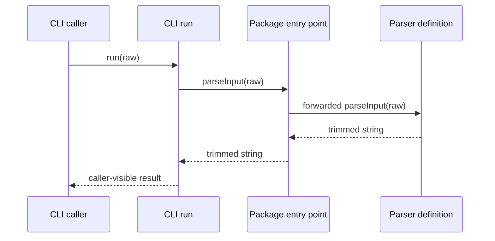

# Reproducible v5 worked examples

Every example uses the complete scaffold emitted by `scripts/prepare_plan.py`.
The executable hydration cases in `tests/skills/plan-change/test_scaffolds_end_to_end.py`
reconstruct the repository, fill every fingerprint and placeholder, validate the
draft, finalize it, and validate the receipt.

## Required command order

1. Run `prepare_plan.py` with a grounded `--anchor PATH[:SYMBOL]`.
2. Fill every scaffold field and preserve provisional classification.
3. Run draft `check_plan.py` without `--require-finalized`.
4. Repair baseline and inventory diagnostics until draft validation passes.
5. Run `finalize_plan.py` and save its exact stdout.
6. Run `check_plan.py --require-finalized` against the finalized output.

`--require-finalized` cannot pass before step 5 because the binding and receipt do
not yet exist.

## Minimal Mermaid blueprint

Use named repository actors and concrete calls; this is the expected level of
detail for a small sequence blueprint:



## Tiny local failure

The fixture at `tests/skills/plan-change/fixtures/tiny/` contains
`normalize_name(name: str | None)`. The pipe in that annotation is also the v5
record field separator, so this example uses a structurally verified
`call-edge` fact rather than writing an invalid `parameters` field.

<!-- tiny-plan:start -->
```markdown
# Handle absent names without changing normalization
<!-- plan-contract: 5 -->
<!-- plan-metadata: {"provisional":{"intent":"bug-fix","risk_domains":[],"tier":"tiny","tier_signals":[]},"final":{"intent":"bug-fix","risk_domains":[],"tier":"tiny","tier_signals":[]}} -->

## Outcome and Scope
- SC-1: given: name is None or a non-null string | when: normalize_name runs | then: None returns an empty string | unchanged: non-null names remain stripped and lowercased

## Evidence Ledger
- F-1: kind: call-edge | path: src/names.py | lines: 1-2 | anchor: normalize_name | excerpt-sha256: b30dd7e221cb9ea99152efd997135f3ee5eeb16868b52b422f68b2eceb7ffd62 | file-sha256: ea37618d0f56f1c3b015271c76e85612106fe17d3fc6cd85f939c6c389432ca1 | observation: normalize_name accepts name as str or None but unconditionally calls name.strip then lower, so None raises AttributeError while non-null strings are stripped and lowercased | caller: normalize_name | callee: name.strip

## Decisions
- D-1: selected: add a local None branch that returns an empty string before existing normalization | evidence: F-1 | rejected: remove None from the accepted parameter type | drawback: treating absence as empty preserves the broad input contract but conflates None with an empty normalized name

## Implementation Specification
- CH-1: path: src/names.py | anchor: normalize_name | status: existing | locality: local-production | reversibility: reversible | evidence: F-1 | change: check whether name is None before calling string methods; return an empty string for None, otherwise preserve the existing strip then lower branch ordering with no side effects or caller changes

## Propagation Record
- P-1: owner: CH-1 | because: F-1 | surface: direct-caller | disposition: changed

## Boundary Traces
- B-1: class: Python function input boundary | path: F-1 | flow: caller passes None or str -> normalize_name selects the None or string branch -> caller receives str

## Domain Obligations

## Traceability
| Criterion / constraint | Changes | Tests |
|---|---|---|
| SC-1 | CH-1 | T-1 |

## Verification
- T-1: given: None, whitespace-padded mixed-case text, and an empty string | when: normalize_name is called for each input | then: results are empty string, stripped lowercase text, and empty string respectively, with the None branch running before strip and no side effects | command: python -m pytest tests/test_names.py -q

## Risks, Assumptions, and Attack
- A-forgotten-propagation: status: repaired | finding: the propagation sweep could miss callers relying on normalize_name raising for None | evidence: F-1 | resolution: CH-1 preserves the typed interface and T-1 verifies the consumer-visible result
- A-boundary-input: status: repaired | finding: the None boundary input currently reaches strip and raises AttributeError | evidence: F-1 | resolution: CH-1 adds the explicit None branch and T-1 verifies None, empty, and nonblank inputs
- A-literal-implementation: status: repaired | finding: a literal implementation could reorder lower and strip or introduce a side effect while adding the branch | evidence: F-1 | resolution: CH-1 fixes branch ordering and no-side-effect behavior and T-1 verifies both
```
<!-- tiny-plan:end -->

The exact extraction and `check_plan.py` rerun, with its passing output, are
kept in `validation-evidence.md`. The focused documentation test performs the
same extraction and validation on every test run.

## Standard propagation

This plan is prepared against `tests/skills/plan-change/fixtures/typescript-standard`
with `--tier standard --intent refactor --anchor src/parser.ts:parseValue`.

<!-- standard-plan:start -->
```markdown
# Rename the shared parser contract without changing parsing behavior
<!-- plan-contract: 5 -->
<!-- plan-metadata: {"provisional":{"intent":"refactor","risk_domains":[],"tier":"standard","tier_signals":["transitive-consumers","shared-internal-interface","multiple-test-surfaces"]},"final":{"intent":"refactor","risk_domains":[],"tier":"standard","tier_signals":["transitive-consumers","shared-internal-interface","multiple-test-surfaces"]}} -->

## Outcome and Scope
- SC-1: given: callers import parseValue through the package entry point | when: the shared parser is renamed to parseInput | then: the definition re-export CLI consumer and parser test all use parseInput | unchanged: whitespace trimming return values errors ordering and side effects remain identical

## Evidence Ledger
- F-1: kind: function-signature | path: src/parser.ts | lines: 1-3 | anchor: parseValue | excerpt-sha256: 3dec50b40993b4638afd4be0cd170296c720a1c7d3d02d03a2920c7a6ffcd483 | file-sha256: 3dec50b40993b4638afd4be0cd170296c720a1c7d3d02d03a2920c7a6ffcd483 | observation: parseValue is the shared parser definition and returns raw.trim without branches errors or side effects | parameters: raw: string | returns: string | async: false
- F-2: kind: documentation-contract | path: src/index.ts | lines: 1-1 | anchor: parseValue | excerpt-sha256: 1cb7da4c83647f5672a5f49abb3679b5a0c3ead2232305771224d328aceaf611 | file-sha256: 1cb7da4c83647f5672a5f49abb3679b5a0c3ead2232305771224d328aceaf611 | observation: the package entry point re-exports parseValue from the parser module
- F-3: kind: call-edge | path: src/cli.ts | lines: 1-5 | anchor: run | excerpt-sha256: d3d8dafada0e2ee56b7594e65b94274e3ec999d5e32c8a1a78c55ddd058d4bc3 | file-sha256: d3d8dafada0e2ee56b7594e65b94274e3ec999d5e32c8a1a78c55ddd058d4bc3 | observation: run imports the package entry point and forwards raw input to parseValue | caller: run | callee: parseValue
- F-4: kind: test-behavior | path: tests/parser.test.ts | lines: 1-5 | anchor: parseValue | excerpt-sha256: e83eac4c21818d7bf7ecfd1e4b3920b1fdbeb98f57308a695c62c8bdfd76b309 | file-sha256: e83eac4c21818d7bf7ecfd1e4b3920b1fdbeb98f57308a695c62c8bdfd76b309 | observation: the parser test imports parseValue from the package root and expects padded input to return trimmed text

## Decisions
- D-1: selected: rename parseValue to parseInput in one dependency-ordered change across the definition forwarding export CLI and test | evidence: F-1, F-2, F-3, F-4 | rejected: keep parseValue as a permanent compatibility alias | drawback: every repository consumer must update in the same change
- C-1: constraint: preserve the exact raw string parameter string return and trim-only behavior while changing only the shared symbol name | evidence: F-1

## Implementation Specification
- CH-1: path: src/parser.ts | anchor: parseValue | status: existing | locality: shared-production | reversibility: reversible | evidence: F-1 | change: rename the exported function to parseInput while preserving the raw string parameter string return synchronous execution trim call branch behavior errors ordering and absence of side effects
- CH-2: path: src/index.ts | anchor: parseValue | status: existing | locality: shared-production | reversibility: reversible | evidence: F-2 | change: replace the parseValue re-export with parseInput after the definition rename and preserve the same parser module target
- CH-3: path: src/cli.ts | anchor: run | status: existing | locality: shared-production | reversibility: reversible | evidence: F-3 | change: import parseInput from the package entry point and call it from run without changing input forwarding return values errors ordering or side effects
- CH-4: path: tests/parser.test.ts | anchor: parseValue | status: existing | locality: test-only | reversibility: reversible | evidence: F-4 | change: update the package-root import and invocation to parseInput while retaining the padded-input fixture and exact trimmed-value expectation

### Execution Blueprint: CH-1, CH-2, CH-3, CH-4 — dependency-ordered shared parser rename [type: dependency-table; domains: none]
| Order | Surface | Literal action and invariant |
|---|---|---|
| 1 | parser definition | Rename the symbol; keep the synchronous raw-string-to-string interface and the single trim return with no new error or side effect. |
| 2 | package re-export | Forward parseInput from the same module only after the definition exists. |
| 3 | CLI consumer | Import the new package surface and preserve run input, return, and call ordering. |
| 4 | parser test | Update the public import and invocation, then assert the unchanged trimmed result. |

## Propagation Record
- P-1: owner: CH-1 | because: F-1 | surface: direct-caller | disposition: changed
- P-2: owner: CH-2 | because: F-2 | surface: re-export | disposition: changed
- P-3: owner: CH-3 | because: F-3 | surface: transitive-consumer | disposition: changed
- P-4: owner: CH-4 | because: F-4 | surface: fixture | disposition: test-only

## Boundary Traces
- B-1: class: package parser input boundary | path: F-1, F-2, F-3 | flow: CLI run receives a raw string -> package entry point forwards parseInput to the parser definition -> caller receives the trimmed string

## Domain Obligations

## Traceability
| Criterion / constraint | Changes | Tests |
|---|---|---|
| SC-1 | CH-1, CH-2, CH-3, CH-4 | T-1 |
| C-1 | CH-1, CH-2, CH-3, CH-4 | T-1 |

## Verification
- T-1: given: package-root and CLI callers with padded empty and already-trimmed strings | when: the targeted parser and CLI tests run after the rename | then: propagation reaches the definition re-export transitive consumer and fixture while boundary inputs literal implementation branch error ordering side effect behavior and exact trimmed outputs remain unchanged | command: npm test -- parser

## Risks, Assumptions, and Attack
- A-forgotten-propagation: status: repaired | finding: propagation could leave the re-export or transitive CLI consumer using parseValue | evidence: F-2, F-3, F-4 | resolution: CH-2, CH-3, CH-4, T-1
- A-boundary-input: status: repaired | finding: boundary input handling could stop trimming empty padded or already-trimmed strings during the rename | evidence: F-1, F-3 | resolution: CH-1, CH-3, T-1
- A-literal-implementation: status: repaired | finding: literal implementation could add a branch error reordering or side effect instead of performing only a symbol rename | evidence: F-1 | resolution: CH-1, T-1
```
<!-- standard-plan:end -->

## TypeScript tiny bug fix

The `typescript-tiny` fixture accepts an optional name but calls `trim`
unconditionally. Its complete executable plan is hydrated by
`test_scaffolds_end_to_end.py`; the key structurally verified fact is:

```markdown
- F-1: kind: call-edge | path: src/names.ts | lines: 1-3 | anchor: normalizeName | excerpt-sha256: 4b8db8bdb0e4f14ce60483811f3cf4699ea5c4669770647c8bb8fc56b67fd5db | file-sha256: 4b8db8bdb0e4f14ce60483811f3cf4699ea5c4669770647c8bb8fc56b67fd5db | observation: optional input reaches an unconditional string normalization call | caller: normalizeName | callee: name.trim
```

The tiny plan owns one local null/undefined guard, preserves trim-then-lowercase
ordering, reconciles the direct-caller inventory entry, validates the draft,
finalizes it, and validates the receipt.

## TypeScript standard re-export propagation

The `typescript-standard` fixture defines `parseValue`, re-exports it through
`src/index.ts`, imports that public surface from `src/cli.ts`, and references it
from a test. Prepare with `--tier standard --intent refactor --anchor
src/parser.ts:parseValue`. Representative current facts are:

```markdown
- F-1: kind: function-signature | path: src/parser.ts | lines: 1-3 | anchor: parseValue | excerpt-sha256: 3dec50b40993b4638afd4be0cd170296c720a1c7d3d02d03a2920c7a6ffcd483 | file-sha256: 3dec50b40993b4638afd4be0cd170296c720a1c7d3d02d03a2920c7a6ffcd483 | observation: parseValue is the shared definition | parameters: raw: string | returns: string | async: false
- F-2: kind: documentation-contract | path: src/index.ts | lines: 1-1 | anchor: parseValue | excerpt-sha256: 1cb7da4c83647f5672a5f49abb3679b5a0c3ead2232305771224d328aceaf611 | file-sha256: 1cb7da4c83647f5672a5f49abb3679b5a0c3ead2232305771224d328aceaf611 | observation: the package entry point re-exports parseValue
- P-2: owner: CH-2 | because: F-2 | surface: re-export | disposition: changed
```

The complete plan also grounds and reconciles the CLI and test candidates,
orders definition before re-export before consumers, and verifies unchanged
trimming behavior.

## Kotlin tiny nullable-input bug fix

The `kotlin-tiny` fixture declares `String?` but dereferences it with `!!`.
Kotlin nullability stays inside the existing `parameters` field; no v5 schema
extension is required.

```markdown
- F-1: kind: call-edge | path: src/Names.kt | lines: 1-3 | anchor: normalizeName | excerpt-sha256: e52f4e44cf79e40aca5a99163a4f82f9b16edd880ac64b19b8476805d08f6367 | file-sha256: e52f4e44cf79e40aca5a99163a4f82f9b16edd880ac64b19b8476805d08f6367 | observation: nullable input reaches an unconditional normalization call | caller: normalizeName | callee: name!!.trim
```

The complete tiny plan adds the null branch before existing normalization and
tests null, empty, and padded mixed-case inputs.

## Kotlin standard facade propagation

Kotlin has no native module re-export. The `kotlin-standard` fixture therefore
uses a public forwarding facade in `src/api/ParserApi.kt`, plus a CLI consumer
and test. Prepare with `--tier standard --intent refactor --anchor
src/internal/Parser.kt:parseValue`.

```markdown
- F-1: kind: function-signature | path: src/internal/Parser.kt | lines: 3-5 | anchor: parseValue | excerpt-sha256: 8e340cd1f88670fe330ce81a55680c40417ccdeebb76b4098356dde9ba5ba375 | file-sha256: cd258db861c9cd5fcebbd6cb4a378757bd26e1ba8d7a2e282bfcdbadd27fcc43 | observation: parseValue is the internal shared definition | parameters: raw: String | returns: String | async: false
- F-2: kind: documentation-contract | path: src/api/ParserApi.kt | lines: 1-5 | anchor: parseValue | excerpt-sha256: 964c91274301df4705b168dc3803e2602e6408746955dad838b81d55d30a2057 | file-sha256: 964c91274301df4705b168dc3803e2602e6408746955dad838b81d55d30a2057 | observation: the public facade forwards parseValue
- P-2: owner: CH-2 | because: F-2 | surface: transitive-consumer | disposition: changed
```

The complete plan grounds every facade, CLI, and fixture candidate, updates
them in dependency order, and preserves the parser result and error behavior.

## Security

This plan is prepared against `tests/skills/plan-change/fixtures/standard`
with `--tier high-risk --risk-domain security --intent bug-fix --anchor
src/flags.py:flags_for`.

<!-- high-risk-plan:start -->
```markdown
# Prevent cross-tenant feature-flag cache reuse
<!-- plan-contract: 5 -->
<!-- plan-metadata: {"provisional":{"intent":"bug-fix","risk_domains":["security"],"tier":"high-risk","tier_signals":[]},"final":{"intent":"bug-fix","risk_domains":["security"],"tier":"high-risk","tier_signals":[]}} -->

## Outcome and Scope
- SC-1: given: two tenants use the same user identifier | when: each tenant requests flags through flags_for | then: each request loads or reuses only that tenant and user pair's flags | unchanged: same-tenant repeated requests remain cached and load_flags output stays unchanged

## Evidence Ledger
- F-1: kind: function-signature | path: src/flags.py | lines: 8-11 | anchor: flags_for | excerpt-sha256: f2cbd4cbe45bbfd9b2bba64f624a673c38967d99a19f257a3376e00eac041e3e | file-sha256: 21b7e17e8ee8288ff4873acd337ad3b8f7c8437d6b04b42ebb527c98fd72da33 | observation: flags_for accepts tenant and user identity but indexes the shared cache only by user_id before returning tenant-derived flags | parameters: tenant_id: str, user_id: str | returns: list[str] | async: false
- F-2: kind: authorization-boundary | path: src/flags.py | lines: 1-11 | anchor: _cache | excerpt-sha256: 21b7e17e8ee8288ff4873acd337ad3b8f7c8437d6b04b42ebb527c98fd72da33 | file-sha256: 21b7e17e8ee8288ff4873acd337ad3b8f7c8437d6b04b42ebb527c98fd72da33 | observation: the module-level shared cache crosses the tenant trust boundary because user_id alone can reuse another tenant's value; no denial or forbidden response, no revocation state, and no audit event or log side effect exists in this module
- F-3: kind: call-edge | path: src/flags.py | lines: 8-11 | anchor: flags_for | excerpt-sha256: f2cbd4cbe45bbfd9b2bba64f624a673c38967d99a19f257a3376e00eac041e3e | file-sha256: 21b7e17e8ee8288ff4873acd337ad3b8f7c8437d6b04b42ebb527c98fd72da33 | observation: a cache miss calls load_flags with both tenant_id and user_id before storing the result | caller: flags_for | callee: load_flags

## Decisions
- D-1: selected: key the shared cache by the ordered tenant_id and user_id pair and preserve load-on-miss behavior | evidence: F-1, F-2, F-3 | rejected: clear the entire cache before every lookup | drawback: composite keys retain one entry per tenant-user pair and therefore use more memory than user-only keys
- C-1: constraint: tenant identity must participate in cache lookup storage and reuse before any cached flags cross the trust boundary | evidence: F-1, F-2

## Implementation Specification
- CH-1: path: src/flags.py | anchor: flags_for | status: existing | locality: shared-production | reversibility: reversible | evidence: F-1 | change: derive one ordered tuple key from tenant_id and user_id before lookup; use that same principal-and-tenant key for membership storage and return so flags_for remains the authorization owner for cache isolation, preserves validation order and load_flags calls only on misses, prevents cross-tenant enumeration and information leakage, and adds no branch errors logging or side effects

### Execution Blueprint: CH-1 — tenant-scoped security cache lookup [type: pseudocode; domains: security]
1. Treat `user_id` as the principal identity and `tenant_id` as the tenant trust-boundary component.
2. Let `flags_for` remain the authorization owner: construct `(tenant_id, user_id)` before checking shared cache state.
3. On a miss, call `load_flags(tenant_id, user_id)` once and store under that identical composite key; on a hit, return only that pair's value.
4. No deny or forbidden response branch exists in this lookup-only API; tenant isolation prevents unauthorized reuse while return and error behavior stay unchanged.

## Propagation Record
- P-1: owner: CH-1 | because: F-1 | surface: direct-caller | disposition: changed

## Boundary Traces
- B-1: class: tenant-scoped feature-flag authorization boundary | path: F-1, F-2, F-3 | flow: caller supplies tenant and principal identifiers -> flags_for checks the composite cache key and loads on a miss -> caller receives flags created for that same tenant-user pair

## Domain Obligations
- O-1: domain: security | obligation: principal | status: satisfied | coverage: user_id is the principal identity component of the composite cache key | evidence: F-1, F-2 | decision: D-1 | changes: CH-1 | tests: T-2
- O-2: domain: security | obligation: tenant | status: satisfied | coverage: tenant_id is the tenant component that partitions cached flag values | evidence: F-1, F-2 | decision: D-1 | changes: CH-1 | tests: T-2
- O-3: domain: security | obligation: trust-boundary | status: satisfied | coverage: the tenant trust boundary is enforced before shared cache reuse | evidence: F-2 | decision: D-1 | changes: CH-1 | tests: T-2
- O-4: domain: security | obligation: authorization-owner | status: satisfied | coverage: flags_for remains the authorization owner for tenant-scoped cache isolation | evidence: F-1, F-2 | decision: D-1 | changes: CH-1 | tests: T-2
- O-5: domain: security | obligation: validation-order | status: satisfied | coverage: validation order constructs tenant and principal identity before membership lookup storage or return | evidence: F-1, F-3 | decision: D-1 | changes: CH-1 | tests: T-3
- O-6: domain: security | obligation: denial-semantics | status: not-applicable | coverage: denial semantics are absent from this lookup-only function | evidence: F-2 | reason: no denial or forbidden response exists because flags_for only returns cached or loaded flag strings
- O-7: domain: security | obligation: enumeration-resistance | status: satisfied | coverage: enumeration resistance prevents a shared user identifier from exposing whether another tenant has cached flags | evidence: F-1, F-2 | decision: D-1 | changes: CH-1 | tests: T-3
- O-8: domain: security | obligation: revocation | status: not-applicable | coverage: revocation state is absent from this in-memory flag cache | evidence: F-2 | reason: no revocation state or revoked-identity input exists in the module
- O-9: domain: security | obligation: audit-behavior | status: not-applicable | coverage: audit behavior is absent from this cache-only module | evidence: F-2 | reason: no audit event or log side effect exists in flags_for or load_flags
- O-10: domain: security | obligation: cross-tenant-tests | status: satisfied | coverage: cross-tenant tests use the same user identifier under two tenants and assert isolated cached values | evidence: F-1, F-2 | decision: D-1 | changes: CH-1 | tests: T-4

## Traceability
| Criterion / constraint | Changes | Tests |
|---|---|---|
| SC-1 | CH-1 | T-1, T-2, T-3, T-4 |
| C-1 | CH-1 | T-2, T-3, T-4 |

## Verification
- T-1: given: empty and populated cache states for one tenant-user pair | when: flags_for runs twice for that pair | then: direct-caller propagation preserves boundary inputs and literal implementation ordering by loading once then returning the identical cached list without added errors logging or side effects | command: python -m pytest tests/test_flags.py -q
- T-2: given: one principal user_id under two tenant identities across the shared trust boundary | when: flags_for resolves each pair | then: the authorization owner returns values containing only the requested tenant and principal identity | command: python -m pytest tests/test_flags.py -q
- T-3: given: a tenant and principal pair absent from the cache | when: flags_for performs validation order and lookup | then: the composite identity is formed before membership so enumeration resistance prevents another tenant's cached state from being exposed and load_flags runs once before storage and return | command: python -m pytest tests/test_flags.py -q
- T-4: given: tenant-a and tenant-b share one user_id | when: cross-tenant calls alternate and repeat | then: security isolation blocks authorization bypass and information leakage by returning tenant-a flags only to tenant-a and tenant-b flags only to tenant-b | command: python -m pytest tests/test_flags.py -q

## Risks, Assumptions, and Attack
- R-1: severity: high | owner: CH-1 | tests: T-4 | risk: a user-only cache hit returns feature flags derived for another tenant and crosses the authorization boundary
- A-forgotten-propagation: status: repaired | finding: propagation could update cache storage but leave lookup or return keyed only by user_id | evidence: F-1, F-3 | resolution: CH-1, T-1
- A-boundary-input: status: repaired | finding: boundary input pairs with equal user_id and different tenant_id currently collide in shared cache state | evidence: F-1, F-2 | resolution: CH-1, T-1
- A-literal-implementation: status: repaired | finding: literal implementation could compute a composite key for membership but still store by user_id or reorder load-on-miss side effects | evidence: F-1, F-3 | resolution: CH-1, T-1
- A-security: status: repaired | finding: the security boundary permits cross-tenant information leakage when equal user identifiers reuse one cache entry | evidence: F-1, F-2 | resolution: CH-1, T-4
- A-authorization-bypass: status: repaired | finding: authorization bypass occurs because tenant permission context is absent from the current cache identity | evidence: F-1, F-2 | resolution: CH-1, T-4
```
<!-- high-risk-plan:end -->

## Concurrency

Prepare with `--tier high-risk --risk-domain concurrency --anchor
src/billing.py:capture`. Specify shared state and lock/transaction ownership,
the worst interleaving, duplicate retry identity, cancellation, and
reconciliation.

## Migration

Prepare with both `--risk-domain durable-state` and `--risk-domain migration`.
Use separate domain-tagged state blueprints when their owning changes differ, or
one blueprint tagged with both domains when it covers current/target state,
partial and interrupted migration, rollback/roll-forward, verification, and
deployment order.

## New-path ownership

For `src/package/new_module.py`, ground `src/package/__init__.py` with a
`directory-ownership` fact whose `directory` is `src/package`, then cite it as
`directory-owner`. For generated output, cite a `generated-from` fact on the
generator source with exact `generator` and `output`; never cite the output as
its own owner.

## Fail-closed repair

An absent anchor, stale digest, copied obligation ownership, incomplete blueprint
concept group, unrelated new-path owner, baseline mutation, or stale categorized
binding leaves the plan unfinalized. Repair the evidence or plan; never edit the
receipt, remove the diagnostic, or downgrade the tier.
